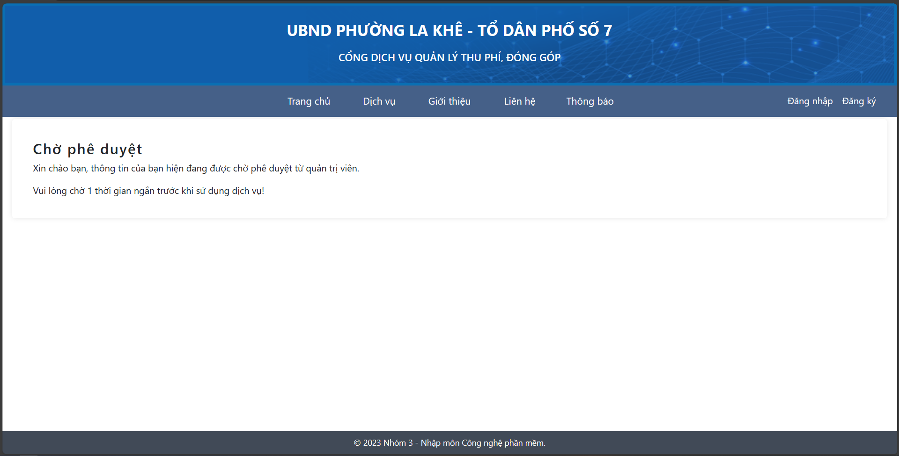
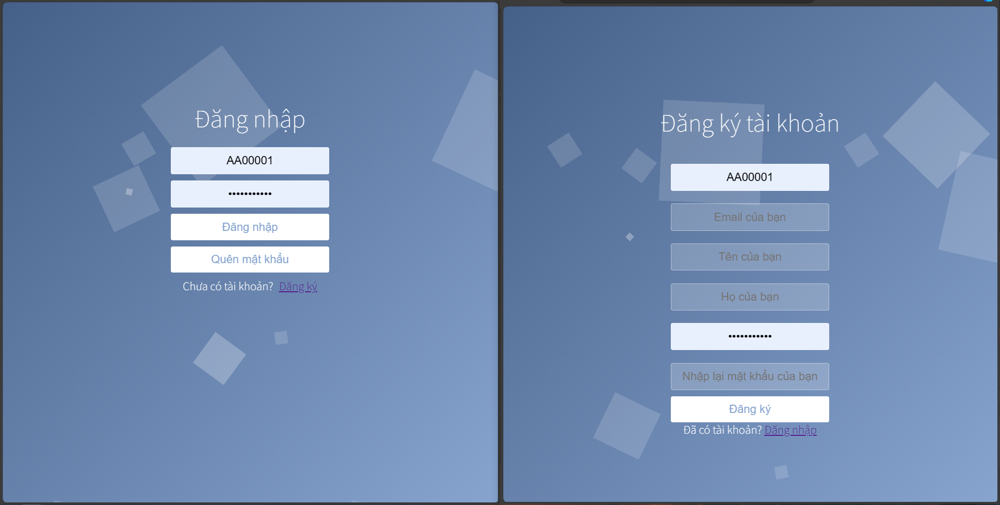
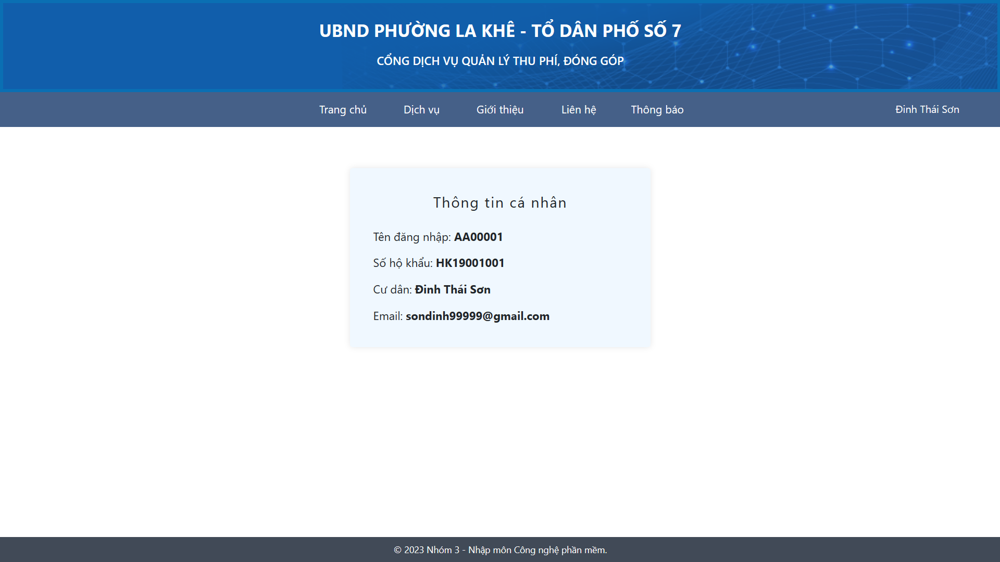
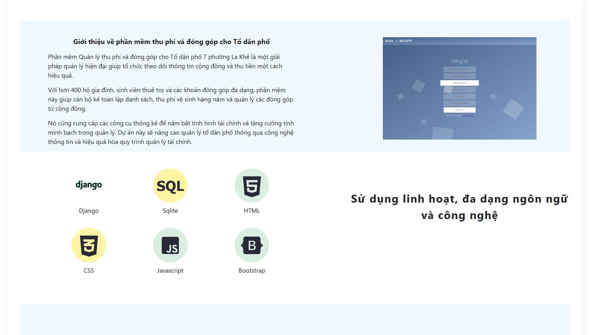
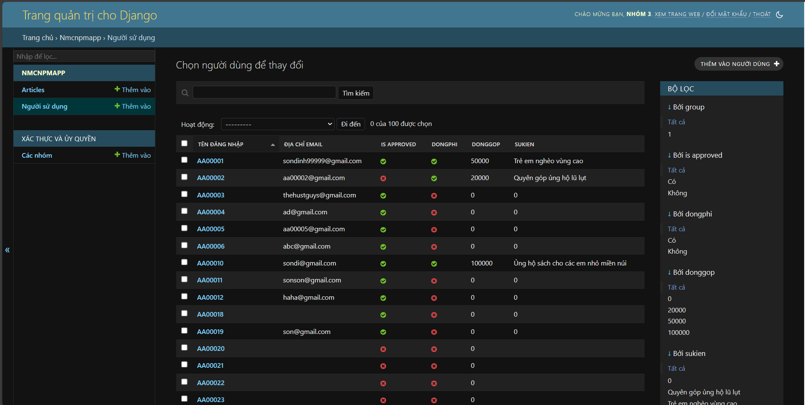
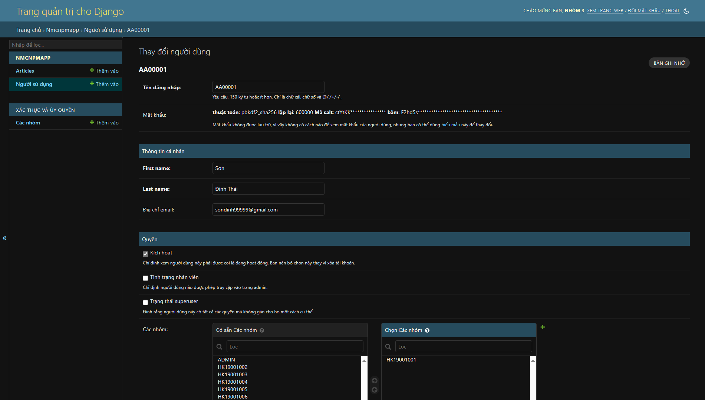
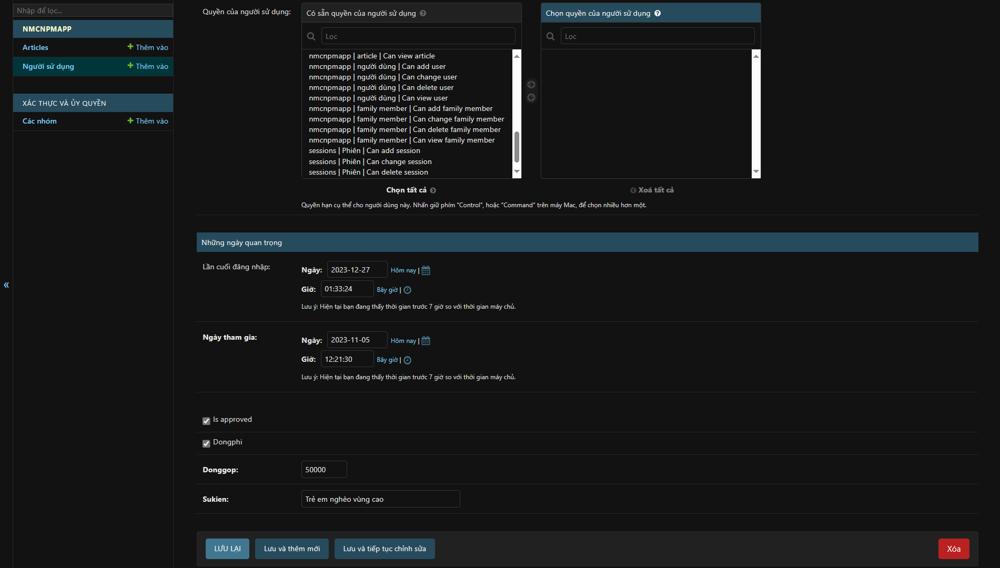
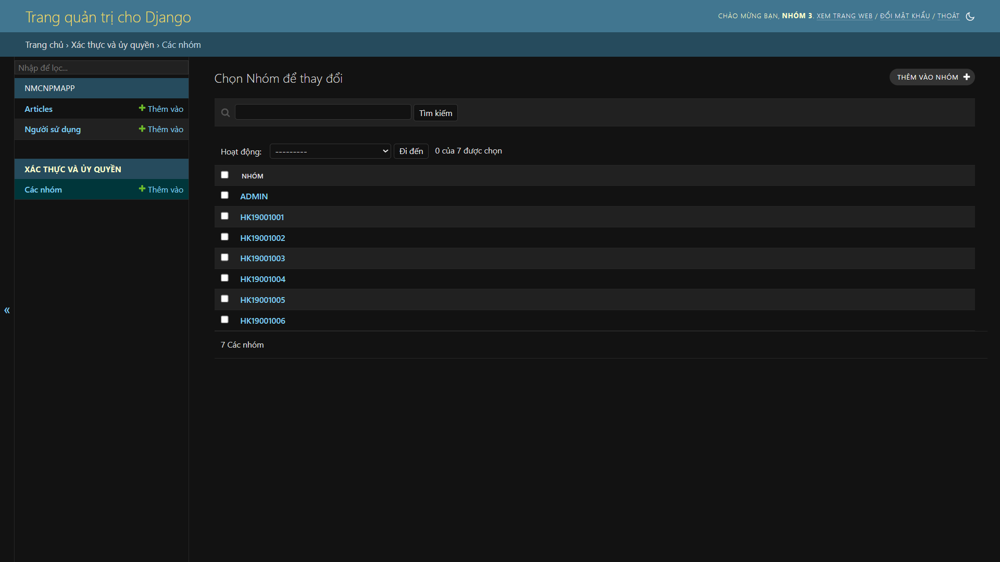
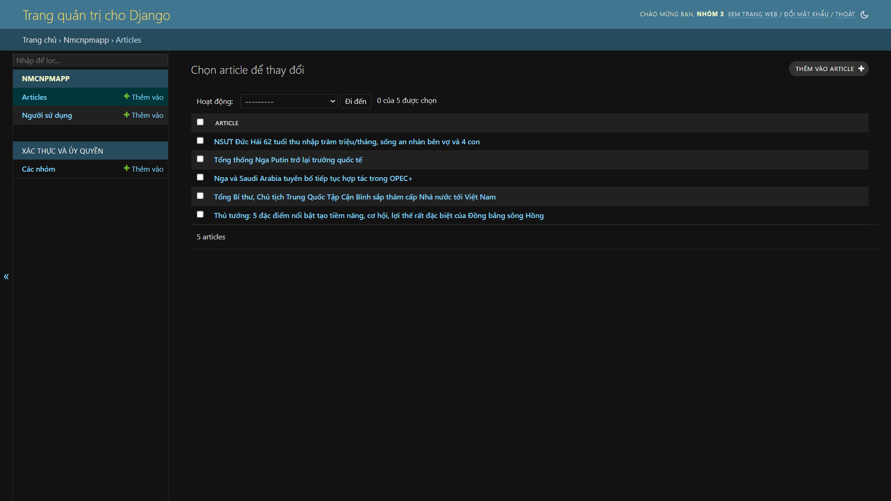

# Bài tập lớn IT3180 - Quản lý thu phí đóng góp
Phần mềm Quản lý thu phí và đóng góp cho Tổ dân phố 7 phường La Khê là một giải pháp quản lý hiện đại giúp tổ chức theo dõi thông tin cộng đồng và thu tiền một cách hiệu quả.

Với hơn 400 hộ gia đình, sinh viên thuê trọ và các khoản đóng góp đa dạng, phần mềm này giúp cán bộ kế toán lập danh sách, thu phí vệ sinh hàng năm và quản lý các đóng góp từ cộng đồng.

Nó cũng cung cấp các công cụ thống kê để nắm bắt tình hình tài chính và tăng cường tính minh bạch trong quản lý. Dự án này sẽ nâng cao quản lý tổ dân phố thông qua công nghệ thông tin và hiệu quả hóa quy trình quản lý tài chính.

## Thành viên nhóm 3
| Thành viên                                        | MSSV     | Vai trò     | Nhiệm vụ                              |
| ------------------------------------------------- | -------- | ----------- | ------------------------------------- |
| [Đinh Thái Sơn](https://github.com/spid3r1337/)   | 20210750 | Trưởng nhóm | Backend, Frontend (Lập trình)         |
| [Bùi Văn Huy](https://github.com/buiihuy)         | 20210443 | Phó nhóm    | Frontend (Thiết kế giao diện)         |
| [Phạm Quang Huy](https://github.com/Huygiauten)   | 20210448 |             | Frontend (Lập trình), Kiểm thử (Test) |
| [Trần Ngọc Bảo](https://github.com/Tran-Ngoc-Bao) | 20215529 |             | Frontend (Lập trình)                  |
| [Vũ Minh Hiển](https://github.com/Minh-Hien2904)  | 20210324 |             | Report (Viết báo cáo)                 |

## Cài đặt (Install & Config)
1. Tải repository
```
git clone https://github.com/vepiot/Quan-Ly-Thu-Phi-Dong-Gop.git
cd Quan-Ly-Thu-Phi-Dong-Gop
```
2. Cài đặt thư viện Django
```
pip install django
python -m django --version
```
Yêu cầu Django phiên bản 4.2.8 trở lên

## Chạy phần mềm trên local (Local Deployment)
Sau khi tải thư viện Django, có thể chạy ứng dụng với lệnh sau:
```
python manage.py runserver
```
Ứng dụng sẽ được chạy local ở [http://localhost:8000](http://localhost:8000) (8000 là port mặc định của Django)

## DEMO 
1. Video giới thiệu sản phẩm [Video DEMO sản phẩm](https://youtu.be/FBIR0gkvZ9A)
2. Sản phẩm demo: [Quản lý thu phí và đóng góp cho Tổ dân phố 7 phường La Khê](https://projectnmcnpm-soict.glitch.me/)
3. Tài khoản thường
Người dùng có thể tự tạo tài khoản ở phần Đăng ký (nhập các thông tin đầy đủ và phải được duyệt thông qua ADMIN để sử dụng bình thường)



4. Tài khoản ADMIN (Đăng nhặp tại [ADMIN](https://projectnmcnpm-soict.glitch.me/admin)):
```
username: admin
password: admin@12345 (mật khẩu mặc định cho các tài khoản user)
```
## Giao diện phía người dùng (Client Interface)
### Homepage


### Trang đăng nhập & đăng ký



### Trang dịch vụ


### Hồ sơ (Profile)



### Trang thông báo thu phí/đóng góp (Notification)



## Giao diện phía ADMIN (Admin Interface)
Phần mềm quản lý thu phí đóng góp cho tổ dân phố là một ứng dụng Web chạy bởi backend là [Django](https://www.djangoproject.com/start/overview/)

### Trang quản lý người dùng



### Chi tiết người dùng





### Trang quản lý mã hộ khẩu



### Trang quản lý tin tức



## Liên hệ (Contact)
Dinh Thai Son: sondinh99999@gmail.com (Trưởng nhóm)
